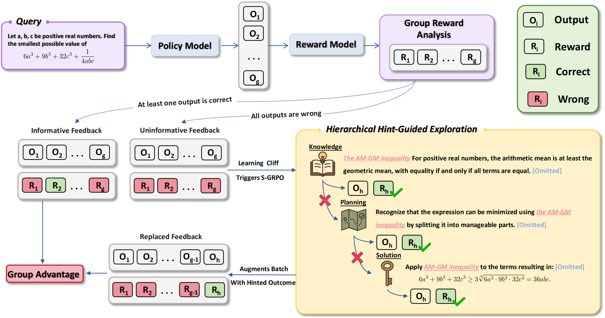

# Scaf-GRPO: Scaffolded Group Relative Policy Optimization for Enhancing LLM Reasoning

<div align="center">

[](https://www.python.org/downloads/)
[](https://opensource.org/licenses/Apache-2.0)
[](https://arxiv.org/abs/2510.19807)
[](https://huggingface.co/datasets/hkuzxc/scaf-grpo-dataset)

</div>

This is the official implementation of **"[Scaf-GRPO: Scaffolded Group Relative Policy Optimization for Enhancing LLM Reasoning](https://arxiv.org/abs/2510.19807)"**.

**Paper**: [Scaf-GRPO: Scaffolded Group Relative Policy Optimization for Enhancing LLM Reasoning](https://arxiv.org/abs/2510.19807)

<br>

Overview of the Scaf-GRPO framework:

<div align=center>

</div>

**Scaf-GRPO** is a progressive training framework designed to overcome the "learning cliff" in reinforcement learning for LLMs. When a model consistently fails on difficult problems, leading to zero-reward signals and stalled progress, Scaf-GRPO intervenes with minimal, hierarchical guidance. By injecting tiered in-prompt hints—from abstract concepts to concrete steps—it enables the model to construct a valid solution, restoring the learning gradient and unlocking its ability to solve problems previously beyond its reach. This on-policy scaffolding approach preserves the model's exploratory autonomy while effectively extending the frontier of its reasoning capabilities.

## Contents
- [Scaf-GRPO: Scaffolded Group Relative Policy Optimization for Enhancing LLM Reasoning](#scaf-grpo-scaffolded-group-relative-policy-optimization-for-enhancing-llm-reasoning)
  - [Contents](#contents)
  - [Installation](#installation)
      - [1. Create and Activate Conda Environment](#1-create-and-activate-conda-environment)
      - [2. Install PyTorch](#2-install-pytorch)
      - [3. Install Core Dependencies (vLLM, SGLang, Megatron-Core)](#3-install-core-dependencies-vllm-sglang-megatron-core)
      - [4. Install Scaf-GRPO and Other Dependencies](#4-install-scaf-grpo-and-other-dependencies)
  - [Training](#training)
      - [1. Download the Training Data](#1-download-the-training-data)
      - [2. Configure Your Training Run](#2-configure-your-training-run)
      - [3. Launch the Training](#3-launch-the-training)
      - [4. (Optional) Running the GRPO Baseline](#4-optional-running-the-grpo-baseline)
  - [Evaluation](#evaluation)
      - [1. Configure the Evaluation Script](#1-configure-the-evaluation-script)
      - [2. Run the Evaluation](#2-run-the-evaluation)
  - [Citation](#citation)
  - [Acknowledgement](#acknowledgement)

## Installation

Our implementation is built upon the excellent [**verl**](https://github.com/volcengine/verl) framework, specifically version `0.4.1.dev`. Our installation process is therefore heavily based on their official guide.

You can either refer to the complete [VERL Installation Guide](https://verl.readthedocs.io/en/latest/start/install.html) for more details or follow the steps below for a tested and verified setup for Scaf-GRPO.

#### 1. Create and Activate Conda Environment
We recommend using Conda to manage the environment.

```bash
conda create --name scaf-grpo python=3.10
conda activate scaf-grpo
```

#### 2. Install PyTorch
Install the PyTorch version compatible with your CUDA environment. We used CUDA 12.4.

```bash
pip install torch==2.6.0 torchvision==0.21.0 torchaudio==2.6.0 --index-url https://download.pytorch.org/whl/cu124
```

#### 3. Install Core Dependencies (vLLM, SGLang, Megatron-Core)
VERL provides a convenient script to install its core dependencies. Run the following command from the root of this repository:

```bash
USE_MEGATRON=0 USE_SGLANG=0 bash scripts/install_vllm_sglang_mcore.sh
```
*Note: We disable `SGLANG` and `MEGATRON` as they are not required for our Scaf-GRPO implementation.*

#### 4. Install Scaf-GRPO and Other Dependencies
Finally, install our project in editable mode along with the remaining requirements.

```bash
# Install this project in editable mode (without dependencies, as we handle them separately)
pip install --no-deps -e .

# Install the remaining Python packages
pip install -r requirements.txt

# Install the symeval library for mathematical evaluation
pip install "git+https://github.com/tongyx361/symeval.git"
```

After these steps, your environment should be fully configured to run Scaf-GRPO.

## Training

Our training pipeline is managed through shell scripts. The main entry point is `train.sh`.

#### 1. Download the Training Data
Our training data, including pre-generated hierarchical hints, is publicly available on Hugging Face at [**hkuzxc/scaf-grpo-dataset**](https://huggingface.co/datasets/hkuzxc/scaf-grpo-dataset).

Run the following command from the root of the `Scaf-GRPO` repository to clone the dataset into the correct directory (`data/DeepScaleR`):
```bash
git clone https://huggingface.co/datasets/hkuzxc/scaf-grpo-dataset data/DeepScaleR
```
```
Scaf-GRPO/
└── data/
    └── DeepScaleR/
        ├── DeepSeek-R1-Distill-Qwen-1.5B.parquet
        ├── Llama-3.2-3B-Instruct.parquet
        ├── Qwen2.5-7B.parquet
        ├── Qwen2.5-Math-1.5B.parquet
        ├── Qwen2.5-Math-7B.parquet
        ├── README.md
        └── train.parquet
```

#### 2. Configure Your Training Run
All training configurations are centralized in shell scripts located in the `sh/` directory. For a standard Scaf-GRPO run, you will need to edit `sh/hint_mix_grpo/bs256_6k_mix.sh`.

Open this file and modify the following key variables:

-   **`PROJECT_NAME` & `EXP_NAME`**: Set your Weights & Biases project and experiment names for logging.
-   **`MODEL_PATH`**: Specify the path to the base model you want to train. This can be a Hugging Face model identifier (e.g., `"meta-llama/Llama-2-7b-hf"`) or a path to a local checkpoint.
-   **`data_train_path`**: Set the path to your training data. After downloading, this should be `"data/DeepScaleR/train.parquet"`.

Example configuration in `sh/hint_mix_grpo/bs256_6k_mix.sh`:
```bash
PROJECT_NAME='scaf-grpo-project'
EXP_NAME='Qwen2.5-math-7b-scaf-grpo'

MODEL_PATH="Qwen/Qwen2.5-Math-7B"

data_train_path="data/DeepScaleR/Qwen2.5-Math-7B.parquet"
```
You can also adjust other hyperparameters like learning rate (`lr`), batch size (`train_batchsize`), etc., in the same script.
> **⚠️ Important Note for Qwen2.5-Math Models**
>
> The default configuration of the `Qwen2.5-math` series models has a `max_position_embeddings` of 4096. Our training setup requires handling a combined length of `data.max_prompt_length=4096` and `data.max_response_length=2048`, which exceeds this limit, especially when hints are added to the prompt.
>
> To accommodate these longer sequences, we have manually modified the `config.json` of these models. If you are using a fresh `Qwen2.5-math` model, you will need to apply these changes to its `config.json` file as well:
> ```json
> {
>   "sliding_window": null,
>   "rope_theta": 15000,
>   "max_position_embeddings": 6144
> }
> ```
#### 3. Launch the Training
The main `train.sh` script is a convenient wrapper that sets up the environment and calls the specific training script. Before running, ensure your `WANDB_API_KEY` is set in this file.

```bash
# In train.sh
export WANDB_API_KEY="YOUR_WANDB_API_KEY"
...
```

Once configured, simply run `train.sh` to start the training:
```bash
bash train.sh
```
This will activate the conda environment and execute the Scaf-GRPO training script (`sh/hint_mix_grpo/bs256_6k_mix.sh`) with an 8-GPU setup.

#### 4. (Optional) Running the GRPO Baseline
We also provide a script for the standard GRPO baseline. To run it, you need to make two changes:

1.  **Configure the baseline script**: Open `sh/baseline/grpo/bs256_6k.sh` and set `MODEL_PATH`, `data_train_path`, etc., just as you did for the Scaf-GRPO script.
2.  **Modify `train.sh`**: Change the script being executed from the Scaf-GRPO one to the baseline one.

```bash
# In train.sh, change this line:
# from:
bash sh/hint_mix_grpo/bs256_6k_mix.sh
# to:
bash sh/baseline/grpo/bs256_6k.sh
```
Then, run `bash train.sh` as before to start the baseline experiment.

## Evaluation

Our evaluation process is handled by a single, comprehensive script that first generates responses from a trained model and then evaluates them.

#### 1. Configure the Evaluation Script
To evaluate a checkpoint, you need to configure the main evaluation script: `sh/generation_eval/do_sample.sh`.

Open this file and modify the following key variables at the top:

-   **`model_path`**: Path to the trained checkpoint directory you want to evaluate.
-   **`data_path`**: Path to the specific benchmark dataset file (e.g., `data/MATH-500/.../test.parquet`).
-   **`save_root_dir`**: The base directory where all evaluation outputs and results will be saved.

You can also adjust generation parameters like `n_samples`, `temperature`, and `top_p` within this script.


#### 2. Run the Evaluation
Once the script is configured, simply execute it. The script will handle both the response generation and the subsequent evaluation automatically.

```bash
bash sh/generation_eval/do_sample.sh
```

The script first calls `verl.trainer.main_generation` to produce model outputs and saves them to a file. It then immediately calls `verl.trainer.main_eval` to process that output file and compute the final scores.

The final results, including generated responses and their evaluation metrics, will be stored in the `save_path` constructed within the script (e.g., `${save_root_dir}/.../generation_output.parquet`).
## Citation
If you find our work and resources useful in your research, please consider citing our paper:
```bibtex
@article{zhang2025scafgrpo,
  title={{Scaf-GRPO: Scaffolded Group Relative Policy Optimization for Enhancing LLM Reasoning}},
  author={Xichen Zhang, Sitong Wu, Yinghao Zhu, Haoru Tan, Shaozuo Yu, Ziyi He, Jiaya Jia},
  journal={arXiv preprint arXiv:2510.19807},
  year={2025}
}
```

## Acknowledgement
We would like to thank the following projects for their great work and inspiration:
-   [verl](https://github.com/volcengine/verl) for their efficient and robust RL framework for LLMs.
-   The authors of [symeval](https://github.com/tongyx361/symeval) for the robust mathematical evaluation library.